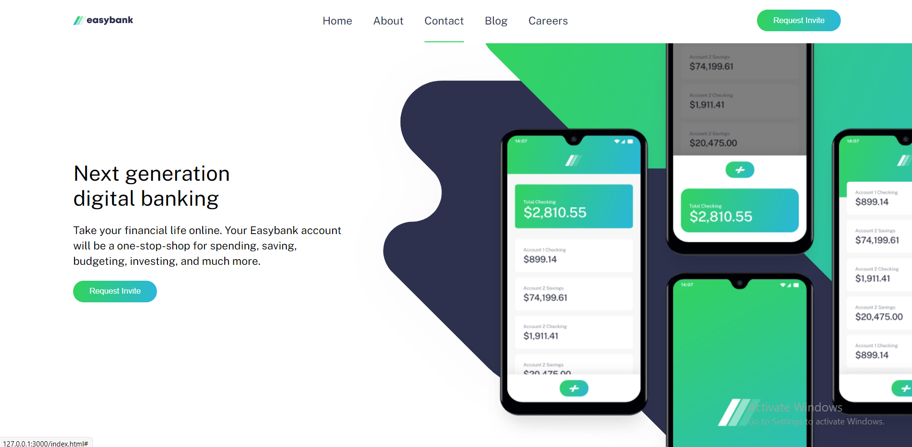
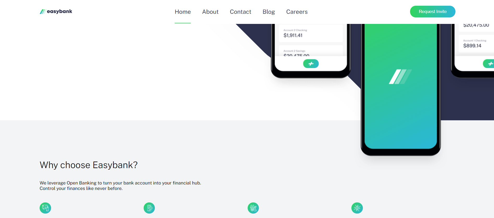
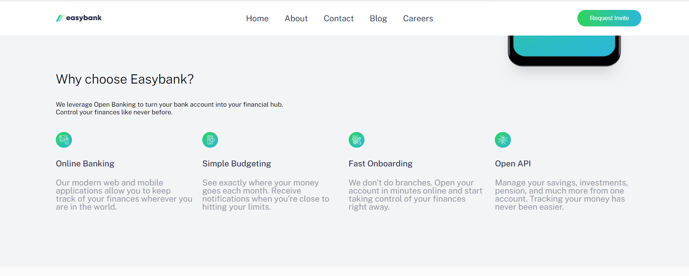
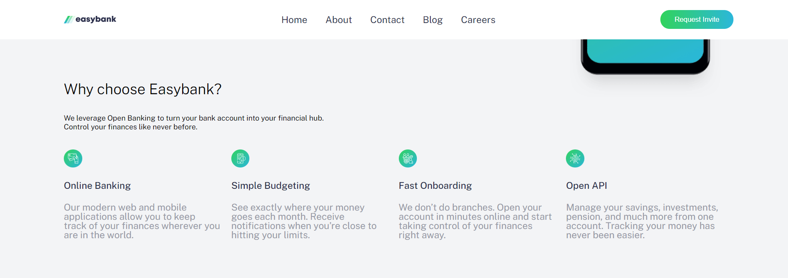
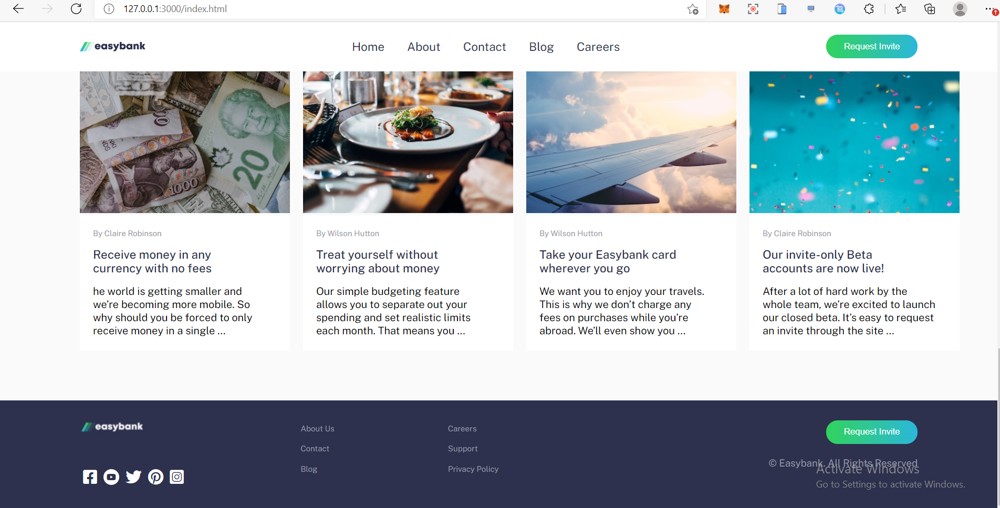
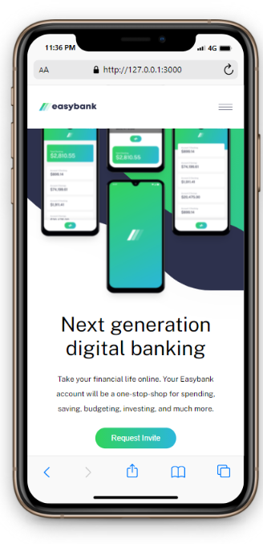

# Frontend Mentor - Easybank landing page solution

This is a solution to the [Easybank landing page challenge on Frontend Mentor](https://www.frontendmentor.io/challenges/easybank-landing-page-WaUhkoDN). Frontend Mentor challenges help you improve your coding skills by building realistic projects.

## Table of contents

- [Overview](#overview)
  - [The challenge](#the-challenge)
  - [Screenshot](#screenshot)
  - [Links](#links)
- [My process](#my-process)
  - [Built with](#built-with)
  - [What I learned](#what-i-learned)
  - [Continued development](#continued-development)
  - [Useful resources](#useful-resources)
- [Author](#author)
- [Acknowledgments](#acknowledgments)

## Overview

This challenge is an easybank design challenge, it designed using HTML, CSS and Js.

### The challenge

Users should be able to:

- View the optimal layout for the site depending on their device's screen size
- See hover states for all interactive elements on the page

### Screenshot










### Links

- Solution URL: [https://github.com/winsofttutorials/easybank-landing-page-master.git]
- Live Site URL: [https://winsofttutorials.github.io/easybank-landing-page-master/]

## My process

I did Desktop first then mobile, and every step came along with its own approach to solving it.

### Built with

- Semantic HTML5 markup
- CSS custom properties
- Flexbox
- CSS Grid
- Mobile-first workflow
- [React](https://reactjs.org/) - JS library
- [Next.js](https://nextjs.org/) - React framework
- [Styled Components](https://styled-components.com/) - For styles

### What I learned

Use this section to recap over some of your major learnings while working through this project. Writing these out and providing code samples of areas you want to highlight is a great way to reinforce your own knowledge.

To see how you can add code snippets, see below:

```html
<h1>Some HTML code I'm proud of</h1>
```

```css
.proud-of-this-css {
  color: papayawhip;
}
```

```js
const proudOfThisFunc = () => {
  console.log("🎉");
};
```

If you want more help with writing markdown, we'd recommend checking out [The Markdown Guide](https://www.markdownguide.org/) to learn more.

### Continued development

Next will be on bringing out the other pages and adding some APIs for financial information

### Useful resources

- [Example resource 1](https://www.example.com) - This helped me for XYZ reason. I really liked this pattern and will use it going forward.
- [Example resource 2](https://www.example.com) - This is an amazing article which helped me finally understand XYZ. I'd recommend it to anyone still learning this concept.

## Author

- Website - [https://winsofttutorials.github.io/easybank-landing-page-master/]
- Frontend Mentor - [@winsofttutorials](https://www.frontendmentor.io/profile/winsofttutorials)
- Twitter - [@IFIDIKUROEPHOD](https://www.twitter.com/IFIDIKUROEPHOD)

## Acknowledgments

SPECIAL APPRECIATION TO EVERYONE WHO HAS DONE THIS TASK AND TO MY MENTOR @Avinash I LOVE YOU.
